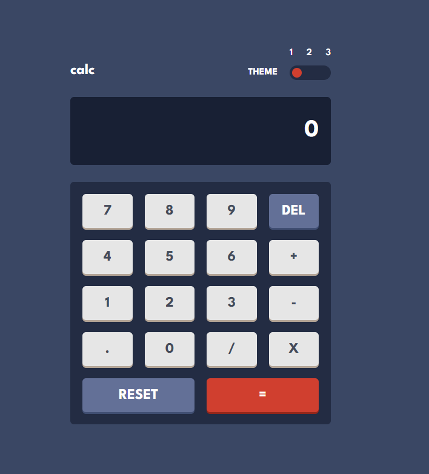
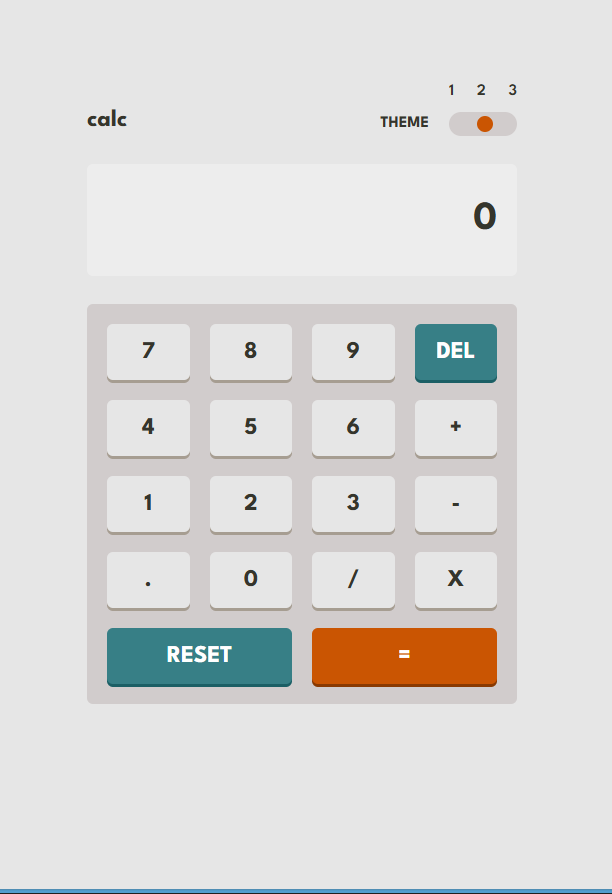
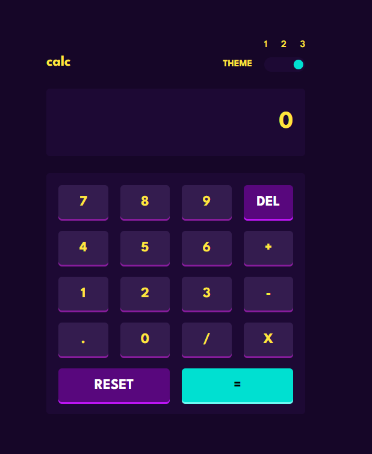

# Frontend Mentor - Calculator app solution

This is a solution to the [Calculator app challenge on Frontend Mentor](https://www.frontendmentor.io/challenges/calculator-app-9lteq5N29). Frontend Mentor challenges help you improve your coding skills by building realistic projects.

## Table of contents

- [Overview](#overview)
  - [The challenge](#the-challenge)
  - [Screenshot](#screenshot)
  - [Links](#links)
- [My process](#my-process)
  - [Built with](#built-with)
  - [What I learned](#what-i-learned)
  - [Continued development](#continued-development)
- [Author](#author)
- [Acknowledgments](#acknowledgments)

## Overview

### The challenge

Users should be able to:

- See the size of the elements adjust based on their device's screen size
- Perform mathmatical operations like addition, subtraction, multiplication, and division
- Adjust the color theme based on their preference
- **Bonus**: Have their initial theme preference checked using `prefers-color-scheme` and have any additional changes saved in the browser

### Screenshot







### Links

- Solution URL: [https://github.com/uptowngirl757/calculator-app](https://github.com/uptowngirl757/calculator-app)
- Live Site URL: [https://calculator-app-dusky-nu.vercel.app/](https://calculator-app-dusky-nu.vercel.app/)

## My process

### Built with

- Semantic HTML5 markup
- CSS custom properties
- Flexbox
- CSS Grid
- Mobile-first workflow
- [React](https://reactjs.org/) - JS library

### What I learned

I learned how to use Tailwind CSS `@layer` base together with CSS variables to implement a multi-theme system. I built three themes (default, light, and neon) by switching styles using the `data-theme` attribute. This helped me understand how theming can be handled in a clean, scalable way without duplicating styles.


```
@layer base {
  [data-theme='light'] {
    /* theme variables */
  }
}
```

I also improved my understanding of how CSS variables and Tailwind layers work together to control global styling across different UI states

### Continued development

I want to deepen my understanding of advanced theming strategies, especially combining Tailwind CSS with React state management and persistence using `localStorage`. I also plan to strengthen my grasp of core JavaScript concepts such as closures, execution context, and asynchronous behavior to write more predictable and scalable code.

### Useful resources

Google and Stack Overflow ;)


## Author

- Frontend Mentor - [@uptowngirl757](https://www.frontendmentor.io/profile/uptowngirl757)


